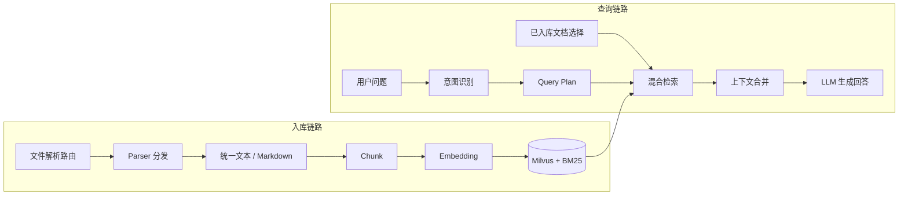
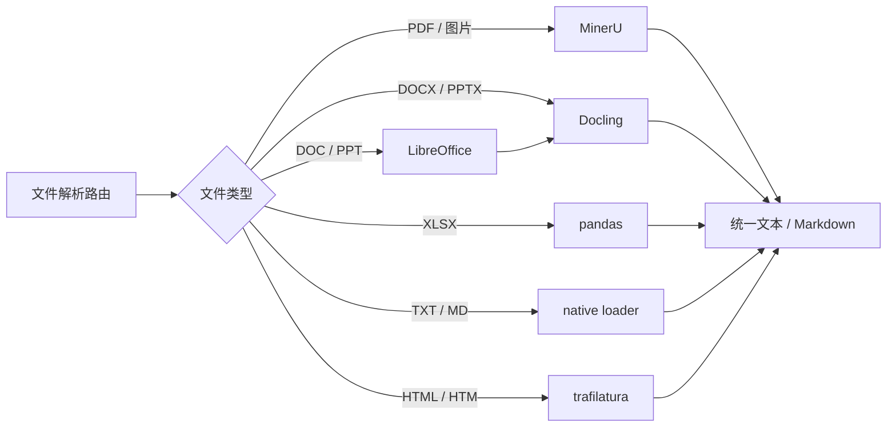
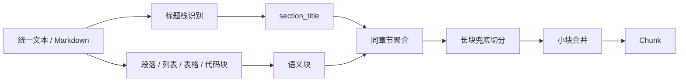
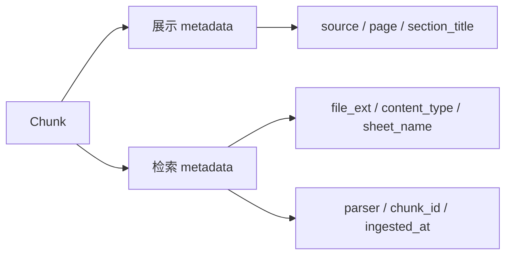
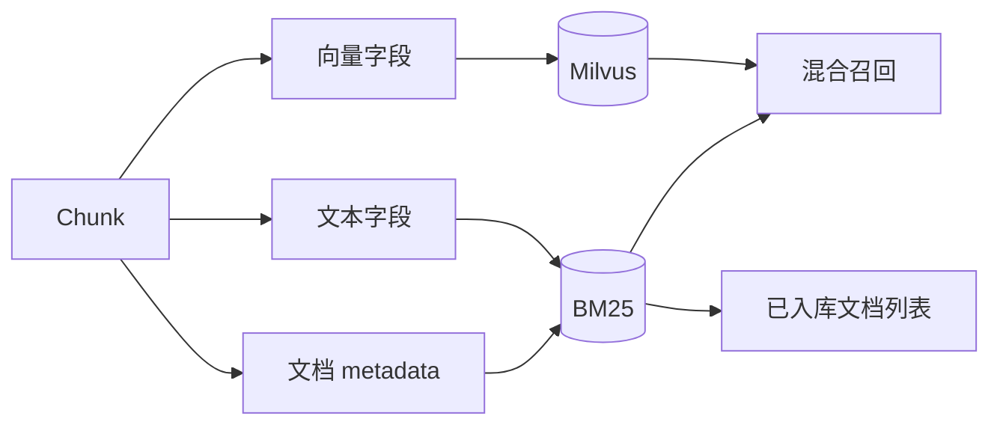
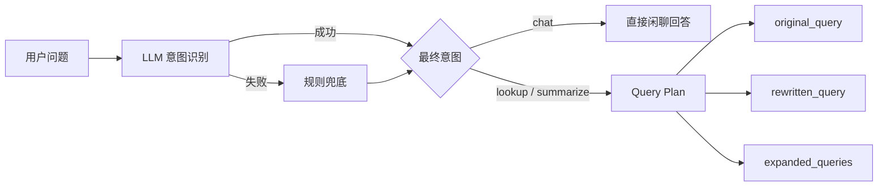
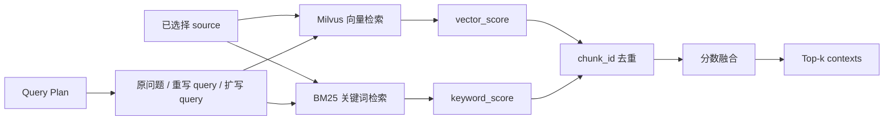
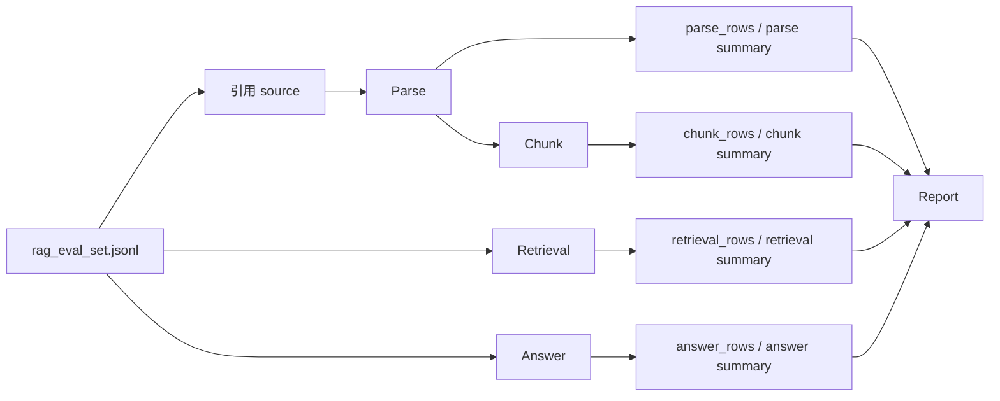

# fabagent-rag

这是一个使用 Milvus 作为向量数据库的轻量 RAG 项目脚手架。

## 包含内容

- 使用 `docker compose` 启动 Milvus standalone 依赖栈
- 默认使用 Milvus `v2.6.15`
- 通过 OpenAI 兼容接口调用嵌入模型
- 按文件类型分发到不同 Parser，并统一转换为 Markdown/text 中间格式
- 提供文档入库和检索问答的 CLI 命令
- 提供 FastAPI 服务接口
- 可选接入 OpenAI 生成最终回答

## 快速开始

1. 创建 Python 虚拟环境：

```bash
python -m venv .venv
source .venv/bin/activate
pip install -e .
```

CPU-only 机器建议先安装 CPU 版 PyTorch，再安装 MinerU：

```bash
pip install "torch==2.6.0+cpu" "torchvision==0.21.0+cpu" --index-url https://download.pytorch.org/whl/cpu
pip install "mineru[core]==3.1.11" -i https://pypi.tuna.tsinghua.edu.cn/simple --trusted-host pypi.tuna.tsinghua.edu.cn
```

2. 启动 Milvus：

```bash
docker compose up -d
```

3. 复制环境变量模板：

```bash
cp .env.example .env
```

4. 将文档放到 `data/raw` 目录，然后执行全量入库：

```bash
rag ingest-all
```

如果只想入库单个文件，仍然可以使用：

```bash
rag ingest data/raw/example.md
```

5. 发起问题：

```bash
rag ask "这个项目是做什么的？"
```

如果没有完整配置推理模型，`rag ask` 会直接返回最相关的检索片段，而不是调用大模型生成回答。

6. 启动 API 服务：

```bash
uvicorn fabagent_rag.api:app --reload
```

启动后访问 `http://127.0.0.1:8000/docs` 查看接口文档。

7. 启动前端开发服务：

```bash
cd frontend
npm install
npm run dev
```

前端默认通过 `/api` 代理访问 `http://127.0.0.1:8000` 的 FastAPI 服务。

也可以用一键开发脚本同时启动 Milvus、后端和前端：

```bash
./scripts/dev.sh
```

前端上传文件可以调用 `POST /ingest/upload`，请求类型为 `multipart/form-data`：

```bash
curl -X POST http://127.0.0.1:8000/ingest/upload \
  -F "files=@data/raw/example.pdf" \
  -F "batch_size=10"
```

如果一次上传多个文件，重复传 `files` 字段即可。服务端会用上传文件名作为检索来源，
不会把临时解析路径写入 Milvus。

## RAG 流程与策略

这一节记录当前项目从文件进入系统到最终回答的完整策略，方便 review 当前实现。
当前实现把“文件解析”并入整条 RAG 流程里，解析结果只是进入 chunk、embedding、存储和检索的统一中间态。

总体流程：



### 1. 文件解析策略

目标是把不同格式统一转换为 Markdown/text 中间格式，后续 chunk、embedding、存储和检索都只处理这一种统一文本。



当前实现：

- 单文件入库：`rag ingest <file>` 或 `POST /ingest`
- 目录全量入库：`rag ingest-all`，默认扫描 `data/raw`
- 前端批量上传：`POST /ingest/upload` 或 `POST /parse/upload`
- 文件类型通过扩展名分发到不同 Parser
- 对用户可见的来源使用文件名，不暴露服务端临时路径

解析器选择：

- PDF、图片：MinerU，保留版面和表格
- DOCX、PPTX：Docling，直接转 Markdown
- DOC、PPT：先本地转换，再复用 Docling
- XLSX：pandas，将 sheet 转表格文本
- TXT、MD：直接读取，不做额外语法处理
- HTML：trafilatura，抽正文

文件类型与 Parser 对照：

| 文件类型 | Parser | 输出 |
| --- | --- | --- |
| PDF、PNG、JPG、JPEG | MinerU | Markdown |
| DOCX、PPTX | Docling | Markdown |
| DOC、PPT | LibreOffice 转换后交给 Docling | Markdown |
| XLSX | pandas | Markdown 表格 |
| TXT | native loader | 原始文本 |
| MD、Markdown | native loader | 原始 Markdown |
| HTML、HTM | trafilatura | Markdown-like 正文 |

### 2. Chunk 策略

目标是尽量让每个 chunk 有完整语义，同时不超过 embedding 模型适合处理的长度。



### 3. Metadata 策略

当前 metadata 分两层：对外只保留必要字段，对内保留检索和调试所需字段。



对员工展示的 metadata：

```json
{
  "source": "文件名",
  "page": 1,
  "section_title": "一级标题 / 二级标题"
}
```

当前状态：

- `source`：文件名或本地文件路径
- `page`：字段已预留；当前解析链路多数情况下拿不到可靠页码，所以未知时返回 `null`
- `section_title`：从 Markdown 标题栈推断
- `chunk_index`：不对前端和 LLM 暴露，避免把技术字段展示给员工

内部检索 metadata：

```json
{
  "file_ext": ".xlsx",
  "content_type": "table",
  "sheet_name": "SPC_Report",
  "parser": "pandas",
  "chunk_id": "稳定哈希",
  "ingested_at": "2026-05-15T12:00:00+00:00"
}
```

用途：

- `file_ext`：区分 PDF、Office、Excel、Markdown 等来源类型
- `content_type`：粗粒度区分 `text`、`table`、`list`、`title`
- `sheet_name`：Excel 表格按 sheet 过滤或加权
- `parser`：排查解析质量，例如 `mineru`、`docling`、`pandas`
- `chunk_id`：多路检索、关键词检索和向量检索合并时稳定去重
- `ingested_at`：后续做增量更新、版本排查和数据刷新

### 4. Embedding 策略

目标是把 chunk 文本转换成向量，写入 Milvus 做相似度搜索。


当前实现：

- 使用 OpenAI 兼容接口调用 embedding 模型
- 模型名由 `EMBEDDING_MODEL` 配置
- API key 和 base URL 当前读取 `ARK_API_KEY`、`ARK_CODING_PLAN_BASE_URL`
- 入库时按批调用 embedding，默认批大小是 10
- embedding 结果会做归一化，因此 Milvus 搜索使用 IP 可以近似 cosine similarity

### 5. 向量存储策略

当前使用 Milvus standalone。



Collection schema：

- `id`：Milvus auto id
- `source`：来源文件
- `page`：页码，未知时内部存 0，对外返回 `null`
- `section_title`：标题路径
- `file_ext`：来源文件扩展名
- `content_type`：chunk 内容类型
- `sheet_name`：Excel sheet 名
- `parser`：解析器名称
- `chunk_id`：稳定 chunk 哈希
- `ingested_at`：入库时间
- `text`：chunk 正文，当前最多写入 8192 字符
- `embedding`：向量字段

索引策略：

- 使用 Milvus `AUTOINDEX`
- metric 使用 `IP`
- 因为 embedding 已归一化，所以 IP 可以近似 cosine similarity

### 6. Query 处理策略

当前 query 处理采用“LLM 优先，规则兜底”的意图识别策略。



### 7. 相似度搜索策略

当前搜索策略：



- 使用 Milvus vector search + SQLite FTS5 BM25 混合检索
- 向量搜索字段：`embedding`
- 关键词索引字段：正文、章节标题、sheet 名、来源文件名和内容类型
- 返回字段：`source`、`page`、`section_title`、`text`
- `top_k` 由 CLI 或前端控制，默认前端为 3，API 默认值为 4
- 每个 Query Plan 中的 query 都会独立检索
- 每个 query 同时执行向量检索和 BM25 检索
- 如果前端选择了文件，source filter 会同时作用于 Milvus 和 BM25
- 多路检索结果优先按 `chunk_id` 去重
- 重复 chunk 会合并 `vector_score` 和 `keyword_score`
- 最终 `score` 是按 intent 加权后的融合分数

意图权重：

| intent | vector weight | keyword weight | 目标 |
| --- | ---: | ---: | --- |
| `lookup` | `0.65` | `0.35` | 兼顾语义召回和精确术语/编号命中 |
| `summarize` | `0.80` | `0.20` | 更偏主题覆盖，避免被少数关键词绑死 |

BM25 策略：

- 使用 SQLite FTS5 的 `bm25()` 排序，不额外引入 pip 依赖
- 英文、数字、编号类 token 直接进入关键词索引
- 中文文本额外写入 bigram/trigram，弥补 SQLite 默认 tokenizer 对中文分词较弱的问题
- `content_type=table` 且 query 包含编号、数字、下划线或短横线时，会获得轻量 metadata boost
- query 命中 `section_title` 或 `sheet_name` 时，也会获得轻量 boost

### 8. 回答生成策略

如果配置了推理模型，会调用 OpenAI 兼容 chat completions 接口生成回答。


当前 prompt 策略：

- system prompt 要求只能根据提供的上下文回答
- 如果上下文不足，需要说明缺少哪些信息
- 上下文会带来源位置：`source / page / section_title`
- 闲聊意图不使用该 prompt，会直接调用推理模型生成简洁回答

如果没有配置推理模型，或者推理接口失败：

- 系统不会中断问答流程
- 会直接返回检索到的上下文
- 这样可以独立排查“检索是否正常”和“生成是否正常”

### 9. 评估模块

评估不是附属脚本，而是项目的一部分，用来分别看解析、chunk、检索和回答是否退化。



测试数据覆盖：

- 文件类型：MD、DOC、DOCX、PPT、PPTX、PDF、XLSX
- 问题类型：概念解释、英文缩写、操作步骤、SOP、故障处理、参数查询、表格问答、总结题、无答案问题、闲聊分流
- 业务内容：OPC、FEOL/BEOL、洁净室制度、刻蚀报警、MES Hold Lot、recipe 参数、SPC 报表、设备点检、ICP-RIE / HF / PECVD 操作、光刻培训、芯片工艺流程
- 评测依据：每条样例绑定 `expected_sources` 和 `expected_answer_contains`，避免构造没有来源支撑的问题

指标计算方式：

| 阶段 | 指标 | 具体计算方式 |
| --- | --- | --- |
| `parse` | `success_rate` | `status == "ok"` 的文件数 / 被评测 source 总数 |
| `parse` | `empty_count` | 解析成功但 `len(text) == 0` 的文件数 |
| `parse` | `avg_chars` | 解析成功文件的文本字符数均值 |
| `parse` | `parser_counts` | 成功文件按 `parser` 统计数量 |
| `chunk` | `avg_chunk_count` | 每个 source 生成 chunk 数量的均值 |
| `chunk` | `avg_chunk_chars` | 每个 source 的平均 chunk 字符数，再取均值 |
| `chunk` | `section_title_coverage` | 有 `section_title` 的 chunk 数 / chunk 总数 |
| `chunk` | `table_chunk_ratio` | `content_type == "table"` 的 chunk 数 / chunk 总数 |
| `chunk` | `short_chunk_ratio` | 长度小于 `MIN_CHUNK_SIZE` 的 chunk 数 / chunk 总数 |
| `retrieval` | `intent_accuracy` | 最终 intent 等于评测集期望 intent 的题数 / 有效题数 |
| `retrieval` | `*_hit_rate` | top-k contexts 中命中任一 `expected_sources` 的题数 / 有效题数 |
| `retrieval` | `*_mrr` | 第一条命中 `expected_sources` 的排名倒数，未命中为 0，再取均值 |
| `retrieval` | `planner_improvement_rate` | planned hybrid MRR 高于 original query MRR 的题数 / 有效题数 |
| `answer` | `pass_rate` | 按题型规则通过的题数 / 有效题数 |
| `answer` | `source_hit_rate` | 回答使用的 contexts 命中 `expected_sources` 的题数 / 有效题数 |
| `answer` | `avg_keyword_hit_ratio` | 答案命中 `expected_answer_contains` 的比例均值 |
| `answer` | `no_answer_pass_rate` | 无答案题中回答包含“资料不足”等提示的比例 |
| `answer` | `chat_pass_rate` | 闲聊题中不返回 contexts 且回答符合预期的比例 |

端到端回答的通过规则比较保守：普通 RAG 题需要 intent 正确、source 命中，并覆盖至少一部分期望关键词；无答案题需要明确说明资料不足；闲聊题不能带检索上下文。

### 10. 前端交互策略

当前前端是一个 RAG 工作台：


- 左侧负责文件上传、自动入库、手动 chunk
- 右侧负责检索问答和来源核对
- 支持批量选择文件上传
- 支持手动编辑 chunk 后确认入库
- 支持从已入库 metadata 加载文档列表，并限定指定文件作为查询范围
- 回答区使用 Markdown 渲染
- 召回上下文默认展示来源，点击后查看具体内容

前端展示来源时优先使用：

```text
source / 第 x 页 / section_title
```

页码为空时不展示页码。

## TODO

- 重排

## 配置

环境变量会从 `.env` 文件中加载。常用的只需要下面这些：

| 名称 | 默认值 | 说明 |
| --- | --- | --- |
| `MILVUS_COLLECTION` | `rag_documents` | Milvus 集合名称 |
| `MINERU_MODEL_SOURCE` | `modelscope` | MinerU 模型下载源；国内环境建议使用 `modelscope` |
| `MINERU_BACKEND` | `pipeline` | MinerU 解析后端；可选 `pipeline`、`vlm-http-client`、`hybrid-http-client`、`vlm-auto-engine`、`hybrid-auto-engine` |
| `CHUNK_SIZE` | `800` | 文档分块字符数 |
| `CHUNK_OVERLAP` | `120` | 文档分块重叠字符数 |
| `MIN_CHUNK_SIZE` | `160` | 小 chunk 阈值；低于该值时会尝试与前后 chunk 合并 |
| `LOOKUP_VECTOR_WEIGHT` | `0.65` | `lookup` 意图下向量检索融合权重 |
| `LOOKUP_KEYWORD_WEIGHT` | `0.35` | `lookup` 意图下 BM25 关键词检索融合权重 |
| `SUMMARIZE_VECTOR_WEIGHT` | `0.80` | `summarize` 意图下向量检索融合权重 |
| `SUMMARIZE_KEYWORD_WEIGHT` | `0.20` | `summarize` 意图下 BM25 关键词检索融合权重 |
| `RAG_PYTHON` | `/home/szlx23/conda/envs/rag/bin/python` | 一键脚本使用的 Python 解释器 |

## 项目结构

```text
.
├── docker-compose.yml
├── frontend
│   ├── index.html
│   ├── package.json
│   └── src
│       ├── App.tsx
│       ├── api/rag.ts
│       ├── components
│       │   ├── AskPanel.tsx
│       │   └── FileUploadPanel.tsx
│       ├── main.tsx
│       ├── styles.css
│       └── types/rag.ts
├── scripts
│   ├── dev.sh
│   ├── dry_run_parse_chunk.py
│   ├── eval.sh
│   └── ingest_all.sh
├── src
│   └── fabagent_rag
│       ├── api.py
│       ├── chunking.py
│       ├── cli.py
│       ├── config.py
│       ├── documents.py
│       ├── embeddings.py
│       ├── evaluation.py
│       ├── intent.py
│       ├── keyword_store.py
│       ├── llm.py
│       ├── milvus_store.py
│       ├── query_planner.py
│       └── rag_service.py
└── data
    └── raw
```

## 常用命令

```bash
rag ingest data/raw/example.md
rag ask "你的问题" --top-k 5
uvicorn fabagent_rag.api:app --reload
./scripts/dev.sh
curl -X POST http://127.0.0.1:8000/ingest/upload -F "files=@data/raw/example.pdf"
python scripts/reset_milvus.py
```
