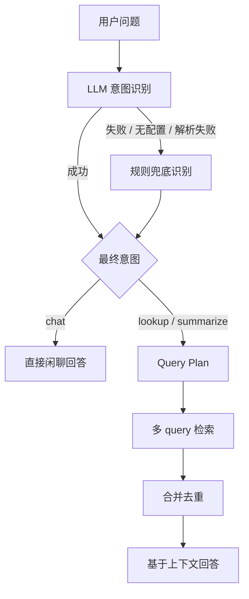

# fabagent-rag

这是一个使用 Milvus 作为向量数据库的轻量 RAG 项目脚手架。

## 包含内容

- 使用 `docker compose` 启动 Milvus standalone 依赖栈
- 默认使用 Milvus `v2.6.15`
- 通过 OpenAI 兼容接口调用嵌入模型
- 按文件类型分发到不同 Parser，并统一转换为 Markdown/text 中间格式
- 提供文档入库和检索问答的 CLI 命令
- 提供 FastAPI 服务接口
- 可选接入 OpenAI 生成最终回答

## 快速开始

1. 创建 Python 虚拟环境：

```bash
python -m venv .venv
source .venv/bin/activate
pip install -e .
```

CPU-only 机器建议先安装 CPU 版 PyTorch，再安装 MinerU：

```bash
pip install "torch==2.6.0+cpu" "torchvision==0.21.0+cpu" --index-url https://download.pytorch.org/whl/cpu
pip install "mineru[core]==3.1.11" -i https://pypi.tuna.tsinghua.edu.cn/simple --trusted-host pypi.tuna.tsinghua.edu.cn
```

2. 启动 Milvus：

```bash
docker compose up -d
```

3. 复制环境变量模板：

```bash
cp .env.example .env
```

4. 将文档放到 `data/raw` 目录，然后执行入库：

```bash
rag ingest data/raw
```

5. 发起问题：

```bash
rag ask "这个项目是做什么的？"
```

如果没有完整配置推理模型，`rag ask` 会直接返回最相关的检索片段，而不是调用大模型生成回答。

6. 启动 API 服务：

```bash
uvicorn fabagent_rag.api:app --reload
```

启动后访问 `http://127.0.0.1:8000/docs` 查看接口文档。

7. 启动前端开发服务：

```bash
cd frontend
npm install
npm run dev
```

前端默认通过 `/api` 代理访问 `http://127.0.0.1:8000` 的 FastAPI 服务。

也可以用一键开发脚本同时启动 Milvus、后端和前端：

```bash
./scripts/dev.sh
```

前端上传文件可以调用 `POST /ingest/upload`，请求类型为 `multipart/form-data`：

```bash
curl -X POST http://127.0.0.1:8000/ingest/upload \
  -F "files=@data/raw/example.pdf" \
  -F "batch_size=10"
```

如果一次上传多个文件，重复传 `files` 字段即可。服务端会用上传文件名作为检索来源，
不会把临时解析路径写入 Milvus。

## 文档解析

入库流程会先识别文件类型，再分发到对应 Parser，最后统一输出 Markdown/text，后续
chunk、embedding、Milvus 写入都复用同一套流程。

| 文件类型 | Parser | 输出 |
| --- | --- | --- |
| PDF、PNG、JPG、JPEG | MinerU | Markdown |
| DOCX、PPTX | Docling | Markdown |
| DOC、PPT | LibreOffice 转换后交给 Docling | Markdown |
| XLSX | pandas + openpyxl + tabulate | Markdown 表格 |
| TXT | native loader | 原始文本 |
| MD、Markdown | native loader | 原始 Markdown |
| HTML、HTM | trafilatura | Markdown-like 正文 |

## RAG 流程与策略

这一节记录当前项目从文件进入系统到最终回答的完整策略，方便 review 当前实现。
其中有些阶段目前还是最小可用版本，后续可以逐步优化。

### 1. 文件解析策略

目标是把不同格式统一转换为 Markdown/text 中间格式，后续 chunk、embedding、存储和检索
都只处理这一种统一文本。

当前实现：

- 单文件路径入库：`rag ingest <file>` 或 `POST /ingest`
- 前端批量上传：`POST /ingest/upload` 或 `POST /parse/upload`
- 不再在 `documents.py` 中处理目录和 glob pattern，批量能力放在上传接口和前端侧
- 文件类型通过扩展名分发到不同 Parser
- 上传文件会先保存到 `data/uploads` 下的临时目录，解析完成后删除临时文件
- 对用户可见的来源使用上传文件名，不暴露服务端临时路径

解析器选择：

- PDF、图片：使用 MinerU CLI，输出 Markdown
- DOCX、PPTX：使用 Docling，输出 Markdown
- DOC、PPT：先用 LibreOffice/soffice 转成 DOCX/PPTX，再交给 Docling
- XLSX：使用 pandas 读取每个 sheet，再用 `DataFrame.to_markdown(index=False)` 转 Markdown 表格
- TXT：直接读取原始文本
- MD/Markdown：直接读取原始 Markdown，不做语法校验
- HTML：使用 trafilatura 抽正文，输出 Markdown-like 文本

MinerU 策略：

- 通过 `MINERU_BACKEND` 配置 MinerU 的 backend
- 默认 `pipeline`，更适合本地 CPU-only 开发环境
- 可选值直接使用 MinerU 原生 backend：`pipeline`、`vlm-http-client`、`hybrid-http-client`、`vlm-auto-engine`、`hybrid-auto-engine`
- 当前关闭公式解析：`--formula false`
- 当前保留表格解析：`--table true`
- `MINERU_MODEL_SOURCE` 默认使用 `modelscope`，适合国内环境下载模型

### 2. Chunk 策略

目标是尽量让每个 chunk 有完整语义，同时不超过 embedding 模型适合处理的长度。

当前自动 chunk 采用结构优先策略：

1. 先把 Markdown/text 识别为语义块
2. 再把同一章节下的相邻语义块打包成 chunk
3. 单个语义块超过 `CHUNK_SIZE` 时，才按长度兜底切分
4. 最后合并过短 chunk，减少没有独立语义的小片段

当前识别的语义块：

- Markdown 标题
- 普通段落
- 有序/无序列表
- Markdown 表格
- fenced code block

标题处理：

- 使用标题栈推断 `section_title`
- 例如 `# A`、`## B`、`### C` 下的内容会得到 `A / B / C`
- fenced code block 中的 `#` 不会被当作标题

合并策略：

- 同一章节内，相邻语义块会尽量合并到一个 chunk
- 不跨章节合并，避免一个 chunk 的来源标题指向不清
- 小于 `MIN_CHUNK_SIZE` 的 chunk 会尝试和前后 chunk 合并
- 合并后不能超过 `CHUNK_SIZE`
- `CHUNK_OVERLAP` 只用于超长语义块的兜底长度切分，不作为主切分策略

手动 chunk：

- 前端可以先解析文件，展示初始 chunk
- 用户可以编辑、插入、删除 chunk
- 后端仍会过滤空 chunk，并按配置合并过短 chunk
- 手动 chunk 的 `section_title` 会从用户提交的文本中用标题栈推断

### 3. Metadata 策略

当前 metadata 分两层：对员工展示的字段保持最小化，内部检索字段适度丰富，
为后续关键词/向量混合检索和 metadata 加权预留空间。

对员工展示的 metadata：

```json
{
  "source": "文件名",
  "page": 1,
  "section_title": "一级标题 / 二级标题"
}
```

当前状态：

- `source`：文件名或本地文件路径
- `page`：字段已预留；当前解析链路多数情况下拿不到可靠页码，所以未知时返回 `null`
- `section_title`：从 Markdown 标题栈推断
- `chunk_index`：不对前端和 LLM 暴露，避免把技术字段展示给员工

内部检索 metadata：

```json
{
  "file_ext": ".xlsx",
  "content_type": "table",
  "sheet_name": "SPC_Report",
  "parser": "pandas",
  "chunk_id": "稳定哈希",
  "ingested_at": "2026-05-15T12:00:00+00:00"
}
```

用途：

- `file_ext`：区分 PDF、Office、Excel、Markdown 等来源类型
- `content_type`：粗粒度区分 `text`、`table`、`list`、`title`
- `sheet_name`：Excel 表格按 sheet 过滤或加权
- `parser`：排查解析质量，例如 `mineru`、`docling`、`pandas`
- `chunk_id`：多路检索、关键词检索和向量检索合并时稳定去重
- `ingested_at`：后续做增量更新、版本排查和数据刷新

这些内部字段可以返回给 API 调试，但回答引用和前端主展示仍以
`source`、`page`、`section_title` 为主，避免把技术字段暴露给普通使用者。

### 4. Embedding 策略

目标是把 chunk 文本转换成向量，写入 Milvus 做相似度搜索。

当前实现：

- 使用 OpenAI 兼容接口调用 embedding 模型
- 模型名由 `EMBEDDING_MODEL` 配置
- API key 和 base URL 当前读取 `ARK_API_KEY`、`ARK_CODING_PLAN_BASE_URL`
- 入库时按批调用 embedding，默认批大小是 10
- embedding 结果会做归一化，因此 Milvus 搜索使用 IP 可以近似 cosine similarity

当前尚未实现：

- 按模型 token limit 自动截断或重切
- embedding 请求重试
- embedding 缓存
- 文档去重或 chunk 去重
- 多路 embedding 模型

### 5. 向量存储策略

当前使用 Milvus standalone。

Collection schema：

- `id`：Milvus auto id
- `source`：来源文件
- `page`：页码，未知时内部存 0，对外返回 `null`
- `section_title`：标题路径
- `file_ext`：来源文件扩展名
- `content_type`：chunk 内容类型
- `sheet_name`：Excel sheet 名
- `parser`：解析器名称
- `chunk_id`：稳定 chunk 哈希
- `ingested_at`：入库时间
- `text`：chunk 正文，当前最多写入 8192 字符
- `embedding`：向量字段

索引策略：

- 使用 Milvus `AUTOINDEX`
- metric 使用 `IP`
- 因为 embedding 已归一化，所以 IP 可以近似 cosine similarity

重建策略：

- 本项目不再兼容旧 collection schema
- 修改 metadata schema 后，执行 `scripts/reset_milvus.py` 再重新入库

### 6. Query 处理策略

当前 query 处理采用“LLM 优先，规则兜底”的意图识别策略。

当前流程：

1. 用户输入原始问题
2. 优先让 LLM 用严格 JSON 判断意图：`lookup`、`summarize`、`chat`
3. 如果 LLM 未配置、调用失败或返回无法解析，使用规则意图识别兜底
4. 最终意图为 `chat`：不检索 Milvus，直接闲聊回答
5. 最终意图为 `lookup`/`summarize`：生成 Query Plan
6. 使用原问题、重写 query、扩写 query 执行多路检索
7. 合并去重后，把召回上下文交给推理模型生成回答

规则兜底策略：

- 包含“总结、概括、归纳、摘要、梳理”等关键词时，识别为 `summarize`
- 明确的问候、感谢、自我介绍、闲聊表达，识别为 `chat`
- 其他问题默认识别为 `lookup`

规则只作为兜底，不作为主判断器。这里故意默认走 `lookup`，因为 LLM 不可用时，
误走知识库检索比误把资料问题当成闲聊更符合当前项目目标。

示意图：



LLM 意图识别策略：

- 只允许输出 `lookup`、`summarize`、`chat`
- 要求返回 JSON：`{"intent":"lookup"}`
- 如果没有配置推理模型、模型调用失败、返回内容解析失败，就回退到规则兜底
- 只有最终意图为 `lookup` 或 `summarize` 时才会访问 Milvus
- 对 RAG 类问题，回答生成仍然受“只能根据召回上下文回答”的约束

Query Plan 策略：

- `original_query`：保留用户原始问题，保证不丢失真实意图
- `rewritten_query`：让 LLM 改写成更短、更适合向量检索的查询
- `expanded_queries`：补充同义词、英文缩写、行业写法差异
- `lookup` 最多扩写 3 条
- `summarize` 通常不扩写，最多扩写 1 条
- Query Plan 生成失败时，只使用原问题检索

当前尚未实现：

- 多轮对话历史压缩
- HyDE
- 关键词检索和向量检索混合召回
- metadata filter
- 按文件、章节、页码过滤

### 7. 相似度搜索策略

当前搜索策略：

- 使用 Milvus vector search
- 搜索字段：`embedding`
- 返回字段：`source`、`page`、`section_title`、`text`
- `top_k` 由 CLI 或前端控制，默认前端为 3，API 默认值为 4
- 每个 Query Plan 中的 query 都会独立检索
- 多路检索结果按 `source + page + section_title + text` 去重
- 重复 chunk 保留最高 score
- score 使用 Milvus 返回的 distance/score

当前尚未实现：

- rerank
- score threshold
- MMR 去冗余
- 同文件/同章节结果合并
- 表格 chunk 特殊排序
- 长上下文压缩

### 8. 回答生成策略

如果配置了推理模型，会调用 OpenAI 兼容 chat completions 接口生成回答。

当前 prompt 策略：

- system prompt 要求只能根据提供的上下文回答
- 如果上下文不足，需要说明缺少哪些信息
- 上下文会带来源位置：`source / page / section_title`
- 闲聊意图不使用该 prompt，会直接调用推理模型生成简洁回答

如果没有配置推理模型，或者推理接口失败：

- 系统不会中断问答流程
- 会直接返回检索到的上下文
- 这样可以独立排查“检索是否正常”和“生成是否正常”

当前尚未实现：

- 引用编号强约束
- 答案置信度
- 无答案检测
- 多 chunk 综合推理优化
- 答案后处理
- 返回结构化 citation

### 9. 前端交互策略

当前前端是一个 RAG 工作台：

- 左侧负责文件上传、自动入库、手动 chunk
- 右侧负责检索问答和来源核对
- 支持批量选择文件上传
- 支持手动编辑 chunk 后确认入库
- 回答区使用 Markdown 渲染
- 召回上下文默认展示来源，点击后查看具体内容

前端展示来源时优先使用：

```text
source / 第 x 页 / section_title
```

页码为空时不展示页码。

## 配置

环境变量会从 `.env` 文件中加载。

| 名称 | 默认值 | 说明 |
| --- | --- | --- |
| `MILVUS_HOST` | `localhost` | Milvus 服务地址 |
| `MILVUS_PORT` | `19530` | Milvus gRPC 端口 |
| `MILVUS_COLLECTION` | `rag_documents` | Milvus 集合名称 |
| `EMBEDDING_API_KEY` | 空 | 嵌入模型 API Key；未配置时会读取 `ARK_API_KEY` |
| `EMBEDDING_BASE_URL` | 空 | 嵌入模型 OpenAI 兼容接口地址 |
| `EMBEDDING_MODEL` | `doubao-embedding-text-240715` | 嵌入模型名称 |
| `MINERU_MODEL_SOURCE` | `modelscope` | MinerU 模型下载源；国内环境建议使用 `modelscope` |
| `MINERU_BACKEND` | `pipeline` | MinerU 解析后端；可选 `pipeline`、`vlm-http-client`、`hybrid-http-client`、`vlm-auto-engine`、`hybrid-auto-engine` |
| `CHUNK_SIZE` | `800` | 文档分块字符数 |
| `CHUNK_OVERLAP` | `120` | 文档分块重叠字符数 |
| `MIN_CHUNK_SIZE` | `160` | 小 chunk 阈值；低于该值时会尝试与前后 chunk 合并 |
| `INFERENCE_API_KEY` | 空 | 推理模型 API Key；未配置时会读取 `ARK_API_KEY` |
| `INFERENCE_BASE_URL` | 空 | 推理模型 OpenAI 兼容接口地址 |
| `INFERENCE_MODEL` | 空 | 推理模型名称 |

## 项目结构

```text
.
+-- docker-compose.yml
+-- frontend
+   +-- src
+       +-- api
+       +-- components
+       +-- types
+-- pyproject.toml
+-- data
|   +-- raw
+-- scripts
|   +-- reset_milvus.py
+-- src
    +-- fabagent_rag
```

## 常用命令

```bash
rag ingest data/raw/example.md
rag ask "你的问题" --top-k 5
uvicorn fabagent_rag.api:app --reload
./scripts/dev.sh
curl -X POST http://127.0.0.1:8000/ingest/upload -F "files=@data/raw/example.pdf"
python scripts/reset_milvus.py
```
